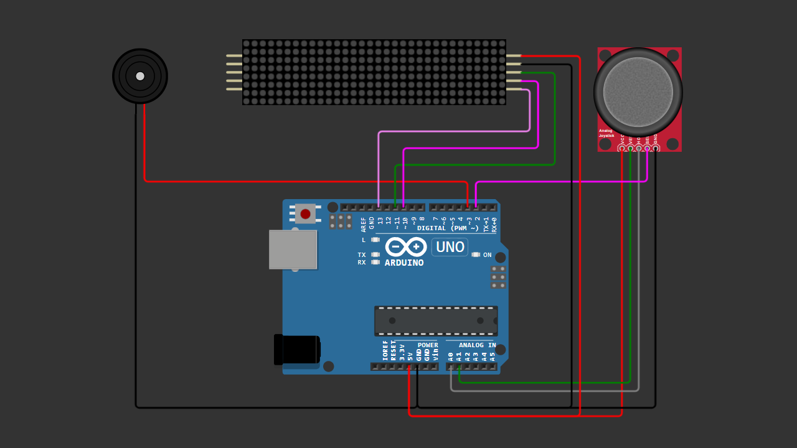

# Arduino Snake Game 32x8 MAX7219 LED Matrix

A beginner-friendly Arduino Snake Game using a 32x8 MAX7219 LED matrix with smooth rendering, joystick control, and no ghosting.

---

## 📌 Project Overview

This project demonstrates how to build a classic Snake Game using Arduino and a 32x8 LED matrix.

The system uses dual rendering:
- **MD_Parola** for text display (start screen & game over)
- **MD_MAX72XX** for game graphics (snake & food)

This separation ensures **clean visuals with no ghosting**, making the gameplay smooth and responsive.

---

## 🧰 Components Required

- Arduino Uno / Nano  
- 32x8 LED Matrix (MAX7219, 4 modules)  
- Joystick Module (VRX, VRY, SW)  
- Buzzer (Active or Passive)  
- Jumper Wires  
- Breadboard (optional)  

---

## 🔌 Wiring Connections

### MAX7219 LED Matrix

| Module Pin | Arduino |
|------------|--------|
| VCC        | 5V     |
| GND        | GND    |
| DIN        | D11    |
| CLK        | D13    |
| CS         | D10    |

---

### Joystick Module

| Joystick Pin | Arduino |
|--------------|--------|
| VCC          | 5V     |
| GND          | GND    |
| VRX          | A0     |
| VRY          | A1     |
| SW           | D2 (INPUT_PULLUP) |

---

### Buzzer

| Buzzer | Arduino |
|--------|--------|
| +      | D3     |
| -      | GND    |

---

## 📷 Wiring Diagram

> Make sure your wiring matches the diagram before uploading the code.

---

## 💻 Arduino Code

Download the Arduino sketch here:

[Download Arduino Code](Arduino_Snake_Game.ino)

Or open the `.ino` file directly from this repository.

---

## 🚀 Getting Started

1. Connect all components according to the wiring table.  
2. Upload the Arduino code to your board.  
3. Power the system.  
4. Wait for the **start screen**.  
5. Press the joystick button to begin.  
6. Control the snake using the joystick.  

---

## 🎮 Controls

- Move Up / Down / Left / Right → Joystick  
- Start / Restart → Press joystick button  

---

## 🧠 Learning Concepts

This project helps you understand:

- LED matrix control (MAX7219)  
- Dual rendering (text vs graphics)  
- Game loop logic  
- Collision detection  
- Array-based object tracking (snake body)  
- Joystick analog input handling  
- Basic sound generation using buzzer  

---

## ✨ Features

- Smooth snake movement  
- No display ghosting  
- Food spawning system  
- Score tracking  
- Game over screen with loop  
- Sound effects (move, eat, game over, start)  

---

## 🎥 Video Tutorial

Watch the full step-by-step tutorial on YouTube:

In this video, you will see:
- Complete wiring demonstration  
- Full gameplay demo  
- Code explanation  
- Sound effects preview  

---

## 📄 License

This project is open-source and free to use for educational purposes.

---

Happy Coding 🚀
